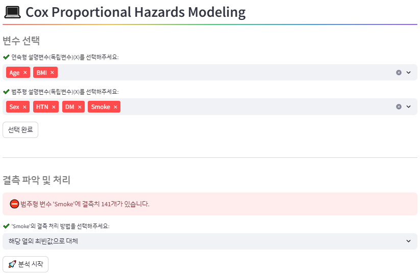

# 🏥 GC DataRoom

GC DataRoom은 의료 데이터를 쉽고 빠르게 분석할 수 있도록 설계된 웹 기반 분석 도구입니다.  
Streamlit을 활용해 누구나 직관적으로 인과 그래프 생성, 변수 코딩, 피봇 변환 등을 수행할 수 있습니다.

[👉 Streamlit 앱 바로가기](https://gc-dataroom.streamlit.app/)

---

## 🚀 주요 기능

♻ **인과관계 추론**  
데이터 간 인과관계를 방향성 그래프(Directed Acyclic Graph, DAG)로 시각화하며,  
조건부 독립성 기반 알고리즘을 통해 변수 간 원인-결과 관계를 추론합니다.  
사용자는 제외할 인과 경로를 rule로 지정할 수 있습니다.  

📝 **피봇 변환**  
환자 ID와 방문일을 기준으로 세로형 데이터(방문별 행)를 가로형(방문별 열)으로 변환합니다.  
최대 방문 횟수를 설정해 과도한 열 생성을 제한할 수 있으며,  
변환 결과는 엑셀 또는 CSV로 다운로드 가능합니다.  

📝 **데이터 코딩**  
조건을 지정해 새로운 변수(예: Age_group, HTN_DM 등)를 생성합니다.  
수치 범위, 논리 연산(AND/OR), 결측 처리 옵션 등을 지원하며,  
결과는 원본 데이터에 열을 추가한 형태로 저장됩니다.  

📝 **판독문 코딩**  
텍스트(판독문) 내 특정 키워드를 기반으로 0, 1 등 클래스를 지정하는 자동 코딩 기능입니다,  
우선순위 및 제외 조건 지정이 가능하며,  
판독문 텍스트에 포함된 키워드를 기반으로 정제된 이진 코딩 데이터를 생성합니다.  

📝 **시각화**  
연속형, 범주형 변수에 대해 barplot, pie chart, histogram, boxplot, heatmap 등의 시각화를 제공합니다.  
상호작용 기능 포함(확대, 다운로드), 그룹별 비교 시각화도 지원됩니다.  

📊 **특성표 산출**  
논문용 Table 1 생성 기능으로, 타겟 변수(0/1 또는 다범주)에 따른 변수들의 분포와  
통계적 차이를 요약한 표를 자동 생성합니다.  
변수 특성에 따라 n(%), mean[IQR] 등의 형식으로 출력됩니다.  

💻 **로지스틱 회귀분석**  
이진 타겟 변수에 대해 OR, 95% CI, ROC curve, confusion matrix, forest plot 등  
결과를 제공하며, 결측 처리 방식도 선택 가능합니다.  
모델 성능 평가 지표도 함께 출력됩니다.  

💻 **생존분석**  
생존 시간과 이벤트 여부를 기준으로 Kaplan-Meier 곡선과 Cox 비례위험모형을 분석합니다.  
변수 선택 후 HR, 95% CI, AUC, confusion matrix, forest plot 등도 자동 생성됩니다.  

---

## 🖼️ 예시 화면

### 🔐 로그인 / 사용자 인증 화면  

### ♻️ 인과관계 추론 화면

### 📝 피봇 변환 화면

### 📝 데이터 코딩 화면

### 📝 판독문 코딩 화면

### 📊 시각화 화면

### 📊 특성표 생성 화면

### 💻 로지스틱 회귀분석 화면

### 💻 생존분석 화면

---

## 🛠️ 기술 스택

- **Frontend**: Streamlit  
- **Backend**: Python (Pandas, Numpy)  
- **Export**: openpyxl (Excel 다운로드 지원)

---

## 📄 라이센스

본 프로젝트는 내부 배포용으로 개발되었으며, 비공개 사용을 전제로 합니다.
